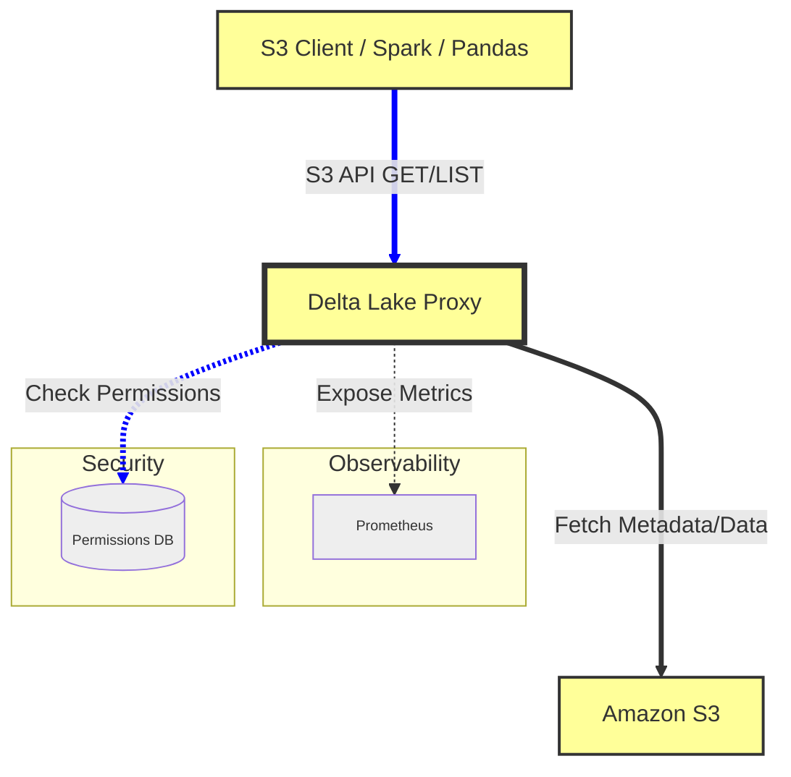
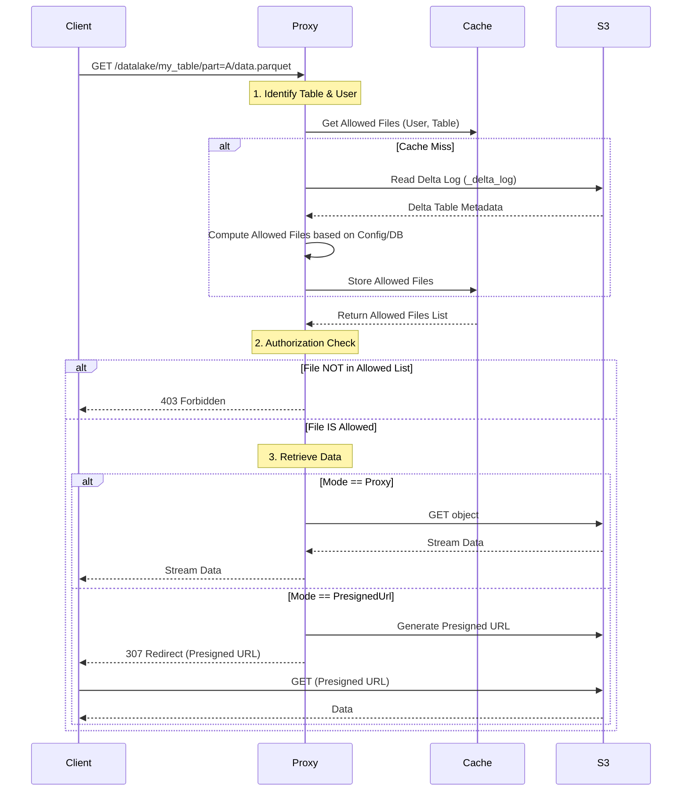

# Delta Lake S3 Proxy Specification

## 1. Introduction

The **Delta Lake S3 Proxy** is a specialized reverse proxy designed to provide controlled, S3-compatible access to Delta Lake tables stored in Amazon S3. It acts as an intermediary between S3-compatible clients (like data processing engines, BI tools, or custom scripts) and the underlying S3 storage.

Its primary goal is to enforce fine-grained, **partition-based access control** without requiring the client to understand Delta Lake protocols or manage complex IAM policies directly. It abstracts the physical S3 location of tables using user-friendly aliases.

## 2. Functional Requirements

### 2.1 S3 API Emulation
The proxy must emulate a subset of the AWS S3 API to ensure compatibility with standard S3 clients.

*   **List Buckets (`GET /`)**: Returns a virtual bucket list. Currently, it exposes a single virtual bucket named `datalake`.
*   **List Objects (`GET /datalake?list-type=2&prefix=...`)**:
    *   Lists objects within the virtual `datalake` bucket.
    *   Supports standard S3 query parameters: `prefix`, `delimiter`, `start-after`, `continuation-token`, `max-keys`.
    *   Maps the virtual path (e.g., `table_alias/path/to/file`) to the actual S3 path.
*   **Get Object (`GET /datalake/path/to/object`)**: Retrieves the content of a file.
*   **Head Object (`HEAD /datalake/path/to/object`)**: Retrieves metadata (size, ETag, last modified) without the body.

### 2.2 Delta Lake Integration & Table Mapping
*   **Table Aliasing**: The proxy must map logical table names (aliases) to physical S3 URIs (e.g., `my_table` -> `s3://my-bucket/data/finance/2024`).
*   **Delta Log Access**: Requests to `_delta_log` directories must be proxied directly to allow clients to read the Delta Lake transaction log.

### 2.3 Access Control & Security
*   **Partition-Based Authorization**:
    *   Access to data files (Parquet) must be restricted based on partition values.
    *   The proxy parses the Delta Lake metadata to understand which files belong to which partitions.
    *   **Rule**: A user is allowed to access a file *only if* the file belongs to a partition set that is explicitly allowed for that table.
    *   **Configuration**: Allowed partitions can be defined in a static configuration file or a database.
*   **Read-Only Mode**: The proxy can be configured to reject all state-modifying requests (`PUT`, `POST`, `DELETE`), effectively making the view read-only.
*   **Authentication Forwarding**: The proxy can forward authentication credentials (e.g., AWS Signature V4) to the backend or validate them against a local cache/database (Mock/Placeholder implementation currently).

### 2.4 Data Retrieval Modes
To optimize performance and cost, the proxy supports two modes for `GET` requests:

1.  **Proxy Mode**: The proxy streams the file content from S3 to the client. The client sees the proxy as the source of truth.
2.  **Presigned URL Mode (Redirect)**: The proxy generates a temporary, pre-signed S3 URL and redirects the client (HTTP 307) to fetch the data directly from S3. This offloads bandwidth from the proxy.
    *   *Exception*: Partial content requests (Range headers) can be configured to always use Proxy Mode (`proxyPartial: true`) to ensure correct behavior if the client doesn't handle redirects for partial content well.

### 2.5 Observability
The proxy must expose metrics via a Prometheus-compatible endpoint (`/metrics`):
*   **Traffic**: Total queries served, total queries proxied.
*   **Users**: Number of unique users (based on Access Key ID) in the last minute.
*   **Performance**: Average backend S3 latency.
*   **Data**: Average message size.

## 3. Non-Functional Requirements

*   **Performance**:
    *   **Caching**: The proxy must cache Delta Lake metadata (table state), file lists (mapping of partitions to files), and authentication results to minimize S3 API calls and latency.
    *   **Streaming**: When proxying data, it must use streaming to keep memory footprint low.
*   **Scalability**: The stateless nature (aside from caches) allows for horizontal scaling.
*   **Configuration**: The system must be configurable via a JSON file (`config.json`) and environment variables (prefixed with `PROXY_`).

## 4. Architecture & Flow

### 4.1 High-Level Component Diagram



### 4.2 Request Flow: Get Object

This sequence diagram illustrates how the proxy handles a request for a data file, enforcing partition permissions.



## 5. Configuration Specification

The application is configured via `config.json`.

| Field | Type | Description | Default |
| :--- | :--- | :--- | :--- |
| `port` | Number | Port to listen on. | `18080` |
| `metricsPort` | Number | Port for Prometheus metrics. | `9090` |
| `tableMapping` | Map | Key: Table Alias, Value: S3 URI. | (Required) |
| `readOnly` | Boolean | If true, rejects PUT/POST/DELETE. | `true` |
| `getMode` | String | `proxy` or `presignedUrl`. | `presignedUrl` |
| `proxyPartial` | Boolean | If true, proxies Range requests even in presigned mode. | `false` |
| `allowedPartitions` | Map | Static partition rules. Key: Table Alias, Value: List of Partition Maps. | `{}` |
| `database` | Object | Database config (URI). | `sqlite:delta_proxy.db` |
| `databaseEnabled` | Boolean | Enable DB-based permissions. | `false` |

**Example:**
```json
{
  "port": 8080,
  "tableMapping": {
    "trades": "s3://my-data-bucket/gold/trades"
  },
  "allowedPartitions": {
    "trades": [
      { "date": "2024-01-01", "region": "US" },
      { "date": "2024-01-02" }
    ]
  }
}
```

## 6. Client-Side Utilities

### 6.1 Local Auth Proxy
To address issues where clients (like Spark) incorrectly forward AWS IAM `Authorization` headers to pre-signed S3 URLs (causing S3 to reject the request), a local Python proxy is available.

See [Client-Side Auth Proxy Specification](client_proxy.md) for details.
