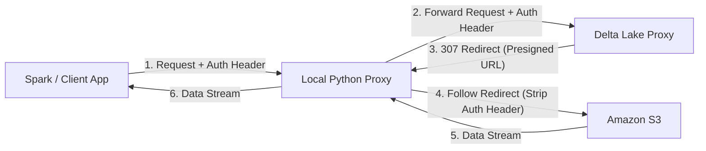
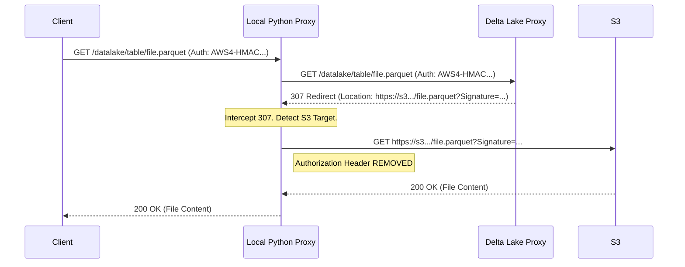

# Client-Side Auth Proxy Specification

## 1. Problem Statement

When the Delta Lake Proxy is configured in `presignedUrl` mode, it redirects clients (like Spark or custom scripts) to a temporary, pre-signed S3 URL using an HTTP 307 Temporary Redirect.

If the client is configured to use AWS IAM authentication (e.g., attaching an `Authorization` header signed with AWS credentials), it may naively forward this header to the new location (the pre-signed S3 URL) when following the redirect.

**The Conflict:**
Amazon S3 rejects requests that contain **both**:
1.  A pre-signed URL signature (in the query string).
2.  An `Authorization` header (from the client's original request).

This results in a `400 Bad Request` error from S3, causing the data retrieval to fail.

## 2. Solution: Local Python Proxy

To resolve this without modifying the client's internal behavior (which might be hardcoded or part of a closed library), we introduce a lightweight **Client-Side Proxy**.

This proxy runs locally on the client's machine (or sidecar) and acts as a middleware.

### 2.1 Architecture

### 2.2 Workflow

1.  **Client Request**: The client sends a request to the `Local Python Proxy` (e.g., `http://localhost:8000/...`) instead of the remote `Delta Lake Proxy`. It includes the AWS `Authorization` header.
2.  **Forwarding**: The `Local Python Proxy` forwards the request to the `Delta Lake Proxy`, preserving the `Authorization` header so the Delta Proxy can authenticate the user.
3.  **Redirect Interception**:
    *   The `Delta Lake Proxy` returns a `307 Temporary Redirect` pointing to a pre-signed S3 URL.
    *   The `Local Python Proxy` intercepts this response.
4.  **Header Stripping & Fetching**:
    *   The `Local Python Proxy` follows the redirect to S3.
    *   **Crucially**, it **removes** the `Authorization` header before making the request to S3. The pre-signed URL itself provides the necessary authorization.
5.  **Streaming Response**: The `Local Python Proxy` streams the response body from S3 back to the Client.

### 2.3 Implementation Details

*   **Language**: Python (using `requests` or `aiohttp`).
*   **Scope**: Single-host / Local use.
*   **Logic**:
    *   Listen on a local port.
    *   For every incoming request:
        *   Construct the upstream URL (Delta Proxy).
        *   Forward the request method, headers, and body.
        *   Check the response status.
        *   If `307` (or `301`/`302`) AND the location is an S3 URL:
            *   Make a new request to the redirect location.
            *   **Exclude** the `Authorization` header.
            *   Stream the result back to the client.
        *   Else:
            *   Stream the response directly back to the client.

### 2.4 Sequence Diagram

